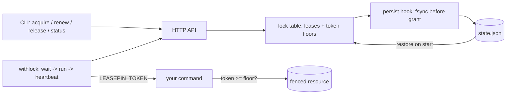

# leasepin

[English](README.md) | [中文](README.zh.md) | [日本語](README.ja.md)

[](LICENSE) [](go.mod) [](CHANGELOG.md)  [](CONTRIBUTING.md)

**leasepin：リースとフェンシングトークンを正しく実装したオープンソースの HTTP ロックサービス——静的バイナリ 1 つ、ファイル永続化の状態、そして任意のコマンドをロック下で実行する `withlock` ラッパー付き。**


```bash
git clone https://github.com/JaydenCJ/leasepin && cd leasepin
go build -o leasepin ./cmd/leasepin    # single static binary, stdlib only
```

> プレリリース：v0.1.0 はまだどのパッケージレジストリにも公開されていません。上記のとおりソースからビルドしてください（Go ≥1.22 であれば可）。

## なぜ leasepin？

どのチームもいずれ同じ 2 つの障害で夜を潰します：前回の実行と重なった cron ジョブ、そして互いに競合してリリースを壊した 2 つのデプロイ。定番の対策にはどれも弱点があります。`flock(1)` は単一ホストでしか効かず、ロックはシェルと共に消えます。Consul・etcd・ZooKeeper は正しく解決しますが、quorum と運用手順書とクライアントライブラリを要求します——「二重に実行しない」ためには過剰すぎるコストです。そして自作ロックサーバーの多くは一番難しい点でつまずきます：ロックだけでは、リース期限を超えて停止（GC、VM 移行、ノート PC の蓋閉じ）したプロセスが目を覚まし、新しい保持者の書き込みを上書きするのを防げません。それには **フェンシングトークン**——付与のたびに厳密に増加するロックごとのカウンター——が必要で、サーバーのクラッシュをまたいでも決して重複しない場合にのみ機能します。leasepin はその難所を単一プロセスで丁寧に作り込んだものです：トークンは払い出す*前に*状態ファイルへ fsync され、フロアは再起動と解放をまたいで存続し、更新はトークンを決して変えず、`leasepin withlock -- <cmd>` はクライアントコードを 1 行も書かずに「取得 + ハートビート + 失効即停止」をスクリプトに与えます。

| | leasepin | flock(1) | Consul lock | Redlock (Redis) |
|---|---|---|---|---|
| フェンシングトークン（単調・クラッシュ安全） | ✅ 付与前に永続化 | ❌ | ⚠️ session ID、非単調 | ❌ 設計上の議論あり |
| 複数ホスト対応 | ✅ ポートに届くホストなら可 | ❌ 単一ホストのみ | ✅ | ✅ |
| サービス再起動後も存続 | ✅ ファイル永続化のフロア + リース | ❌ | ✅ quorum が必要 | ⚠️ 永続化設定に依存 |
| コマンド実行ラッパー | ✅ `withlock`：更新 + 失効即 kill | ⚠️ 更新なし・フェンシングなし | ⚠️ `consul lock`、フェンシング環境変数なし | ❌ |
| 必要なインフラ | プロセス 1 つ、JSON ファイル 1 つ | なし | 3–5 ノードのクラスター | Redis（Redlock は ×5） |
| ランタイム依存 | 0（Go 標準ライブラリ） | util-linux | Consul agent + servers | Redis + クライアントライブラリ |

<sub>2026-07-13 時点で確認：leasepin は Go 標準ライブラリのみを import。フェンシングなしの Redlock アルゴリズムの安全性は 2016 年から公に議論されている。`consul lock` のドキュメントにはラップしたコマンド向けのフェンシングトークン相当物がない。</sub>

## 特徴

- **フェンシングトークンを正しく** — ロックごとの `uint64` が、解放・期限切れ・保持者・再起動をまたいで厳密に増加。増加したカウンターは付与が返る*前に* fsync され、永続化に失敗したトークンは焼却され二度と発行されません。
- **デッドロックではなくリース** — すべてのロックは TTL 付きで保持され、更新がなければ期限で消滅。クラッシュしたジョブがシステムを塞ぎ続けることはありません。期限判定は遅延評価かつ境界含み：競合する掃除スレッドは存在しません。
- **どんなスクリプトにも `withlock`** — 取得（`--wait` 可）、子プロセスへの `LEASEPIN_TOKEN` エクスポート、ttl/3 での更新、サーバーの一時的な不調への耐性、そしてリース喪失が確定した瞬間の SIGTERM→SIGKILL による停止と終了コード 11。
- **busy と gone の決定的な区別** — HTTP 409 は「正当に保持中、後で再試行」、HTTP 410 は「リース喪失、即時停止」。ラッパーも終了コード 10 と 11 で同様に分岐します。
- **ファイル永続化、クラッシュに正直** — アトミック書き込み（一時ファイル + fsync + rename）、空きロックはトークンフロアを永久保持、状態ファイルが壊れていればサーバーはフェンシングを黙ってリセットせず起動を拒否します。
- **単一プロセス・依存ゼロ** — Go 標準ライブラリのみ、デフォルトで `127.0.0.1` にバインド、テレメトリなし・設定ファイルなし。状態全体が人間に読める 1 つの JSON 文書です。

## クイックスタート

```bash
./leasepin serve --state /var/lib/leasepin/state.json &
./leasepin acquire --name nightly-backup --holder cron-web01 --ttl 30s
./leasepin acquire --name nightly-backup --holder cron-web02 --ttl 30s
```

実際にキャプチャした出力：

```text
leasepin 0.1.0 serving on http://127.0.0.1:7420 (state: /var/lib/leasepin/state.json, 0 live leases restored)
acquired nightly-backup: token 1, holder cron-web01, expires in 30s
leasepin acquire: lock "nightly-backup" is held by "cron-web01" until 2026-07-13T05:57:26Z
```

2 回目の acquire は終了コード 10 で終わり、重複した cron 実行はそのサイクルを飛ばすだけです。コマンドのラップも 1 行で済みます（実際の出力）：

```text
$ ./leasepin withlock --name deploy --ttl 30s -- sh -c 'echo "deploying with fencing token $LEASEPIN_TOKEN"'
deploying with fencing token 1
$ ./leasepin status --name deploy
deploy: free (last token 1)
```

リースは取得され、バックグラウンドで更新され、コマンド終了時に解放されます——トークンフロアはその後も残り、次の付与は必ずより大きくなります。

## フェンシングを一段落で

ロックだけでは陳腐化したライターから守れません：プロセスはリースを保持したまま期限を超えて停止し、目覚めた後も資源を所有していると思い込めます。フェンシングはこれを資源側で修復します。すべての付与は、そのロックでこれまでに付与されたどのトークンよりも大きいトークンを伴い、ストレージは受理済みの最大トークンを記録してそれ未満を拒否します——時間の感覚を失ったライターの小さいトークンは必ず弾かれます。`withlock` はトークンを `LEASEPIN_TOKEN` としてエクスポートし、`examples/fenced-writer.sh` が契約全体をエンドツーエンドで実演し、[docs/protocol.md](docs/protocol.md) が正確に規定します。

## CLI リファレンス

`leasepin [serve|withlock|acquire|renew|release|status|list|version]` — 終了コード：0 正常、2 用法エラー、3 実行時エラー、**10 ロック使用中、11 リース喪失**。すべてのクライアントコマンドは `--server` / `LEASEPIN_SERVER`（デフォルト `http://127.0.0.1:7420`）に対応します。

| フラグ | デフォルト | 効果 |
|---|---|---|
| `--state`（serve） | `leasepin.state.json` | リースとトークンフロアの状態ファイル |
| `--addr`（serve） | `127.0.0.1:7420` | 待ち受けアドレス（理由がなければループバックのまま） |
| `--min-ttl` / `--max-ttl`（serve） | `100ms` / `24h` | 受け付けるリース TTL の範囲 |
| `--quiet`（serve） | オフ | リクエストログを stderr に出さない |
| `--name` | — | ロック名（`A-Z a-z 0-9 . _ -`、≤128） |
| `--holder` | host-pid-random | リースの保持者；`status`/`list` に表示 |
| `--ttl` | `30s` | リース期間；`withlock` は ttl/3 で更新 |
| `--wait` / `--poll` | `0` / `1s` | 使用中ロックの再試行時間と間隔 |
| `--renew-every`（withlock） | ttl/3 | ハートビート間隔の上書き |
| `--kill-grace`（withlock） | `5s` | 失効時の SIGTERM→SIGKILL の猶予 |
| `--format` | `text` | acquire/renew/status/list の `text` か `json` |

これらのコマンドの背後にある HTTP API（6 つの JSON エンドポイント）は [docs/protocol.md](docs/protocol.md) に規定されています。

## 検証

このリポジトリは CI を同梱しません。上記のすべての主張はローカル実行で検証されます：

```bash
go test ./...            # 90 deterministic tests, no sleeps, offline
bash scripts/smoke.sh    # end-to-end CLI check, prints SMOKE OK
```

## アーキテクチャ



## ロードマップ

- [x] v0.1.0 — クラッシュ安全な単調フェンシングトークン付きリーステーブル、アトミックなファイル永続化、6 エンドポイントの HTTP API、更新と失効即 kill を備えた `withlock` ラッパー、完全な CLI、90 テスト + smoke スクリプト
- [ ] `leasepin steal` — フロア引き上げ付き・監査される運用者向け強制解放
- [ ] クライアント側ポーリングを置き換えるロングポーリング acquire（`?wait_ms=`）
- [ ] 非ループバック待ち受け向けの任意の bearer トークン認証
- [ ] 同一プロセスから配信する読み取り専用の Web ステータスページ
- [ ] Go（公開モジュール）と shell（`curl` レシピ）のクライアント

全リストは [open issues](https://github.com/JaydenCJ/leasepin/issues) を参照してください。

## コントリビュート

Issue・議論・PR を歓迎します——ローカルのワークフロー（フォーマット、vet、テスト、`SMOKE OK`）は [CONTRIBUTING.md](CONTRIBUTING.md) を参照。入門タスクには [good first issue](https://github.com/JaydenCJ/leasepin/issues?q=is%3Aissue+is%3Aopen+label%3A%22good+first+issue%22) のラベルがあり、設計の議論は [Discussions](https://github.com/JaydenCJ/leasepin/discussions) で行われています。

## ライセンス

[MIT](LICENSE)
