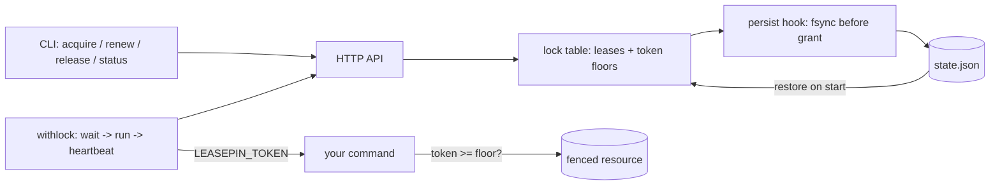

# leasepin

[English](README.md) | [中文](README.zh.md) | [日本語](README.ja.md)

[](LICENSE) [](go.mod) [](CHANGELOG.md)  [](CONTRIBUTING.md)

**leasepin：an open-source HTTP lock service with leases and fencing tokens done right — one static binary, file-persisted state, and a `withlock` wrapper that runs any command under a lock.**


```bash
git clone https://github.com/JaydenCJ/leasepin && cd leasepin
go build -o leasepin ./cmd/leasepin    # single static binary, stdlib only
```

> Pre-release: v0.1.0 is not tagged on a package registry yet; build from source as above (any Go ≥1.22).

## Why leasepin?

Every team eventually loses an evening to the same two incidents: a cron job that overlapped its previous run, and two deploys that raced each other into a broken release. The classic fixes all disappoint somewhere. `flock(1)` only works on one host and its lock dies with the shell. Consul, etcd, or ZooKeeper solve it properly but demand a quorum, an ops runbook, and a client library — absurd overhead for "don't run this twice". And most homegrown lock servers get the hard part wrong: a lock alone cannot stop a process that was paused (GC, VM migration, laptop lid) past its lease expiry from waking up and writing over the new holder's work. That requires **fencing tokens** — a per-lock counter that strictly increases with every grant — and they only work if they never repeat, including across a server crash. leasepin is that one hard thing done carefully in one process: tokens are fsynced to a state file *before* they are handed out, floors survive restarts and releases, renewals never change the token, and `leasepin withlock -- <cmd>` gives your scripts acquire + heartbeat + stop-on-lease-loss without writing a line of client code.

| | leasepin | flock(1) | Consul lock | Redlock (Redis) |
|---|---|---|---|---|
| Fencing tokens (monotonic, crash-safe) | ✅ persisted before grant | ❌ | ⚠️ session IDs, not monotonic | ❌ disputed by design |
| Works across hosts | ✅ any host that can reach the port | ❌ single host | ✅ | ✅ |
| Survives service restart | ✅ file-persisted floors + leases | ❌ | ✅ needs a quorum | ⚠️ depends on persistence config |
| Run-a-command wrapper | ✅ `withlock`: renew + kill on loss | ⚠️ no renewal, no fencing | ⚠️ `consul lock`, no fencing env | ❌ |
| Infrastructure required | one process, one JSON file | none | 3–5 node cluster | Redis (×5 for Redlock) |
| Runtime dependencies | 0 (Go stdlib) | util-linux | Consul agent + servers | Redis + client library |

<sub>Checked 2026-07-13: leasepin imports the Go standard library only; the Redlock algorithm's safety without fencing has been publicly disputed since 2016; `consul lock` documents no fencing-token equivalent for wrapped commands.</sub>

## Features

- **Fencing tokens done right** — a per-lock `uint64` that strictly increases across releases, expiries, holders, and restarts. The incremented counter is fsynced to disk *before* the grant returns; if persistence fails, the token is burned, never reissued.
- **Leases, not deadlocks** — every lock is held for a TTL and dies at its deadline unless renewed, so a crashed job can never wedge the system. Expiry is lazy and inclusive: no reaper thread to race.
- **`withlock` for any script** — acquire (optionally `--wait`), export `LEASEPIN_TOKEN` to the child, renew at ttl/3, tolerate transient server blips, and SIGTERM→SIGKILL the command with exit 11 the moment the lease is truly lost.
- **Busy vs gone, load-bearing** — HTTP 409 means "validly held, retry later"; HTTP 410 means "your lease is lost, stop now". Wrappers branch on exit codes 10 and 11 the same way.
- **File-persisted, crash-honest** — atomic writes (temp + fsync + rename), free locks keep their token floor forever, and a corrupt state file makes the server refuse to start instead of silently resetting fencing.
- **One process, zero dependencies** — Go standard library only, binds `127.0.0.1` by default, no telemetry, no config file; the whole state is one human-readable JSON document.

## Quickstart

```bash
./leasepin serve --state /var/lib/leasepin/state.json &
./leasepin acquire --name nightly-backup --holder cron-web01 --ttl 30s
./leasepin acquire --name nightly-backup --holder cron-web02 --ttl 30s
```

Real captured output:

```text
leasepin 0.1.0 serving on http://127.0.0.1:7420 (state: /var/lib/leasepin/state.json, 0 live leases restored)
acquired nightly-backup: token 1, holder cron-web01, expires in 30s
leasepin acquire: lock "nightly-backup" is held by "cron-web01" until 2026-07-13T05:57:26Z
```

The second acquire exits with code 10 — a duplicate cron run simply skips its cycle. And wrapping a command takes one line (real output):

```text
$ ./leasepin withlock --name deploy --ttl 30s -- sh -c 'echo "deploying with fencing token $LEASEPIN_TOKEN"'
deploying with fencing token 1
$ ./leasepin status --name deploy
deploy: free (last token 1)
```

The lease was acquired, renewed in the background, and released when the command finished — and the token floor stays behind, so the next grant is strictly higher.

## Fencing in one paragraph

A lock alone cannot save you from a stale writer: a process can hold a lease, stall past its expiry, and wake up believing it still owns the resource. Fencing fixes this at the resource. Every grant carries a token greater than every token ever granted for that lock, and your storage keeps the highest token it has accepted, rejecting anything lower — so the stale writer's smaller token bounces no matter how confused it is about time. `withlock` exports the token as `LEASEPIN_TOKEN`; `examples/fenced-writer.sh` shows the whole contract running end to end, and [docs/protocol.md](docs/protocol.md) specifies it precisely.

## CLI reference

`leasepin [serve|withlock|acquire|renew|release|status|list|version]` — exit codes: 0 ok, 2 usage, 3 runtime, **10 lock busy, 11 lease lost**. All client commands honor `--server` / `LEASEPIN_SERVER` (default `http://127.0.0.1:7420`).

| Flag | Default | Effect |
|---|---|---|
| `--state` (serve) | `leasepin.state.json` | state file for leases and token floors |
| `--addr` (serve) | `127.0.0.1:7420` | listen address (keep it loopback unless you know why) |
| `--min-ttl` / `--max-ttl` (serve) | `100ms` / `24h` | accepted lease TTL range |
| `--quiet` (serve) | off | do not log requests to stderr |
| `--name` | — | lock name (`A-Z a-z 0-9 . _ -`, ≤128) |
| `--holder` | host-pid-random | who holds the lease; shown in `status`/`list` |
| `--ttl` | `30s` | lease lifetime; `withlock` renews at ttl/3 |
| `--wait` / `--poll` | `0` / `1s` | keep retrying a busy lock, and how often |
| `--renew-every` (withlock) | ttl/3 | heartbeat interval override |
| `--kill-grace` (withlock) | `5s` | SIGTERM→SIGKILL gap when the lease is lost |
| `--format` | `text` | `text` or `json` on acquire/renew/status/list |

The HTTP API behind these commands (six JSON endpoints) is specified in [docs/protocol.md](docs/protocol.md).

## Verification

This repository ships no CI; every claim above is verified by local runs:

```bash
go test ./...            # 90 deterministic tests, no sleeps, offline
bash scripts/smoke.sh    # end-to-end CLI check, prints SMOKE OK
```

## Architecture



## Roadmap

- [x] v0.1.0 — lease table with crash-safe monotonic fencing tokens, atomic file persistence, six-endpoint HTTP API, `withlock` wrapper with renewal and lost-lease kill, full CLI, 90 tests + smoke script
- [ ] `leasepin steal` — audited operator force-release with a floor bump
- [ ] Long-poll acquire (`?wait_ms=`) to replace client-side polling
- [ ] Optional bearer-token auth for non-loopback listeners
- [ ] Read-only web status page served from the same process
- [ ] Client packages for Go (public module) and shell (`curl` recipes)

See the [open issues](https://github.com/JaydenCJ/leasepin/issues) for the full list.

## Contributing

Issues, discussions and pull requests are welcome — see [CONTRIBUTING.md](CONTRIBUTING.md) for the local workflow (format, vet, tests, `SMOKE OK`). Good entry points are labelled [good first issue](https://github.com/JaydenCJ/leasepin/issues?q=is%3Aissue+is%3Aopen+label%3A%22good+first+issue%22), and design questions live in [Discussions](https://github.com/JaydenCJ/leasepin/discussions).

## License

[MIT](LICENSE)
