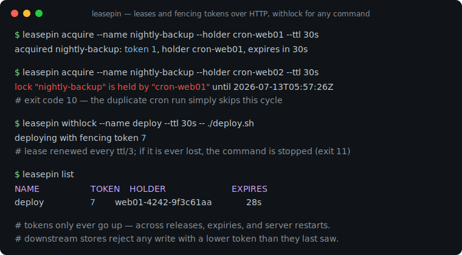
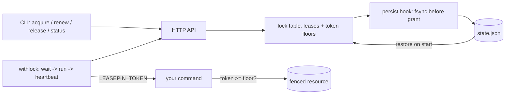

# leasepin

[English](README.md) | [中文](README.zh.md) | [日本語](README.ja.md)

[](LICENSE) [](go.mod) [](CHANGELOG.md)  [](CONTRIBUTING.md)

**leasepin：开源的 HTTP 锁服务，把租约与 fencing token 做对——单个静态二进制、文件持久化状态，外加一个能让任何命令在锁下运行的 `withlock` 包装器。**



```bash
git clone https://github.com/JaydenCJ/leasepin && cd leasepin
go build -o leasepin ./cmd/leasepin    # single static binary, stdlib only
```

> 预发布：v0.1.0 尚未发布到任何包仓库；请按上述方式从源码构建（Go ≥1.22 均可）。

## 为什么选 leasepin？

每个团队迟早都会为同样的两起事故熬上一晚：cron 任务与上一轮运行重叠，以及两次部署互相竞争、把发布跑坏。经典解法各有硬伤。`flock(1)` 只在单机上有效，锁还随 shell 一起消失。Consul、etcd、ZooKeeper 能正确解决，但要求 quorum、运维手册和客户端库——为了"别跑两次"付出的代价荒谬。而多数自研锁服务都栽在最难的那一点上：仅靠锁无法阻止一个被暂停（GC、虚拟机迁移、合盖）超过租约期限的进程醒来后覆盖新持有者的写入。这需要 **fencing token**——每把锁一个随每次授予严格递增的计数器——而它只有在永不重复（包括服务器崩溃前后）时才有效。leasepin 就是把这一件难事在单进程里认真做好：token 在发放*之前*先 fsync 到状态文件，下限跨重启与释放存续，续约永不改变 token，而 `leasepin withlock -- <cmd>` 让你的脚本无需写一行客户端代码就获得"获取 + 心跳 + 失锁即停"。

| | leasepin | flock(1) | Consul lock | Redlock (Redis) |
|---|---|---|---|---|
| Fencing token（单调、崩溃安全） | ✅ 发放前先持久化 | ❌ | ⚠️ session ID，非单调 | ❌ 设计上存在争议 |
| 跨主机可用 | ✅ 能连上端口的任何主机 | ❌ 仅单机 | ✅ | ✅ |
| 服务重启后存续 | ✅ 文件持久化的下限 + 租约 | ❌ | ✅ 需要 quorum | ⚠️ 取决于持久化配置 |
| 命令包装器 | ✅ `withlock`：续约 + 失锁即杀 | ⚠️ 无续约、无 fencing | ⚠️ `consul lock`，无 fencing 环境变量 | ❌ |
| 所需基础设施 | 一个进程、一个 JSON 文件 | 无 | 3–5 节点集群 | Redis（Redlock 需 ×5） |
| 运行时依赖 | 0（Go 标准库） | util-linux | Consul agent + servers | Redis + 客户端库 |

<sub>核对于 2026-07-13：leasepin 仅导入 Go 标准库；Redlock 算法在无 fencing 下的安全性自 2016 年起被公开质疑；`consul lock` 的文档中没有为被包装命令提供 fencing token 等价物。</sub>

## 特性

- **把 fencing token 做对** — 每把锁一个 `uint64`，跨释放、过期、持有者与重启严格递增。递增后的计数器在授予返回*之前*先 fsync 落盘；若持久化失败，该 token 作废，永不再发。
- **租约而非死锁** — 每把锁按 TTL 持有，到期未续约即失效，崩溃的任务永远卡不死系统。过期判定惰性且含端点：没有可竞争的清理线程。
- **任何脚本都能用 `withlock`** — 获取（可 `--wait`）、向子进程导出 `LEASEPIN_TOKEN`、按 ttl/3 续约、容忍服务器瞬时抖动，并在租约确认丢失的那一刻以 SIGTERM→SIGKILL 停止命令并退出 11。
- **busy 与 gone 的关键区分** — HTTP 409 意为"被合法持有，稍后重试"；HTTP 410 意为"你的租约已失，立即停止"。包装器同样按退出码 10 与 11 分支。
- **文件持久化、对崩溃诚实** — 原子写入（临时文件 + fsync + rename），空闲锁永久保留 token 下限，状态文件损坏时服务器拒绝启动，而不是悄悄重置 fencing。
- **单进程、零依赖** — 仅 Go 标准库，默认绑定 `127.0.0.1`，无遥测、无配置文件；全部状态就是一份人类可读的 JSON 文档。

## 快速上手

```bash
./leasepin serve --state /var/lib/leasepin/state.json &
./leasepin acquire --name nightly-backup --holder cron-web01 --ttl 30s
./leasepin acquire --name nightly-backup --holder cron-web02 --ttl 30s
```

真实捕获的输出：

```text
leasepin 0.1.0 serving on http://127.0.0.1:7420 (state: /var/lib/leasepin/state.json, 0 live leases restored)
acquired nightly-backup: token 1, holder cron-web01, expires in 30s
leasepin acquire: lock "nightly-backup" is held by "cron-web01" until 2026-07-13T05:57:26Z
```

第二次 acquire 以退出码 10 结束——重复的 cron 运行只是跳过本轮。包装一条命令也只需一行（真实输出）：

```text
$ ./leasepin withlock --name deploy --ttl 30s -- sh -c 'echo "deploying with fencing token $LEASEPIN_TOKEN"'
deploying with fencing token 1
$ ./leasepin status --name deploy
deploy: free (last token 1)
```

租约被获取、在后台续约、命令结束后释放——而 token 下限留了下来，下一次授予必然严格更高。

## 一段话讲清 fencing

仅靠锁救不了过期写入者：一个进程可以持有租约、停顿到超过期限，醒来后仍以为自己拥有资源。fencing 在资源侧修复这一点。每次授予携带的 token 都大于该锁曾授予过的任何 token，而你的存储记录已接受的最高 token 并拒绝更低者——于是过期写入者的小 token 无论它对时间多糊涂都会被弹回。`withlock` 将 token 导出为 `LEASEPIN_TOKEN`；`examples/fenced-writer.sh` 端到端演示了完整契约，[docs/protocol.md](docs/protocol.md) 给出精确规范。

## CLI 参考

`leasepin [serve|withlock|acquire|renew|release|status|list|version]` — 退出码：0 正常、2 用法错误、3 运行时错误、**10 锁被占用、11 租约丢失**。所有客户端命令支持 `--server` / `LEASEPIN_SERVER`（默认 `http://127.0.0.1:7420`）。

| 标志 | 默认值 | 作用 |
|---|---|---|
| `--state`（serve） | `leasepin.state.json` | 存放租约与 token 下限的状态文件 |
| `--addr`（serve） | `127.0.0.1:7420` | 监听地址（除非清楚后果，请保持回环） |
| `--min-ttl` / `--max-ttl`（serve） | `100ms` / `24h` | 可接受的租约 TTL 范围 |
| `--quiet`（serve） | 关闭 | 不向 stderr 输出请求日志 |
| `--name` | — | 锁名（`A-Z a-z 0-9 . _ -`，≤128） |
| `--holder` | host-pid-random | 租约持有者；显示在 `status`/`list` 中 |
| `--ttl` | `30s` | 租约时长；`withlock` 按 ttl/3 续约 |
| `--wait` / `--poll` | `0` / `1s` | 对占用锁持续重试多久，以及重试间隔 |
| `--renew-every`（withlock） | ttl/3 | 心跳间隔覆盖 |
| `--kill-grace`（withlock） | `5s` | 失锁时 SIGTERM→SIGKILL 的间隔 |
| `--format` | `text` | acquire/renew/status/list 输出 `text` 或 `json` |

这些命令背后的 HTTP API（六个 JSON 端点）规范见 [docs/protocol.md](docs/protocol.md)。

## 验证

本仓库不附带 CI；上述所有断言均由本地运行验证：

```bash
go test ./...            # 90 deterministic tests, no sleeps, offline
bash scripts/smoke.sh    # end-to-end CLI check, prints SMOKE OK
```

## 架构



## 路线图

- [x] v0.1.0 — 具备崩溃安全单调 fencing token 的租约表、原子文件持久化、六端点 HTTP API、带续约与失锁即杀的 `withlock` 包装器、完整 CLI、90 个测试 + smoke 脚本
- [ ] `leasepin steal` — 带审计与下限抬升的运维强制释放
- [ ] 长轮询 acquire（`?wait_ms=`），取代客户端轮询
- [ ] 为非回环监听提供可选的 bearer token 认证
- [ ] 同进程提供只读 Web 状态页
- [ ] Go（公开模块）与 shell（`curl` 配方）客户端

完整列表见 [open issues](https://github.com/JaydenCJ/leasepin/issues)。

## 贡献

欢迎 issue、讨论与 PR——本地工作流（格式化、vet、测试、`SMOKE OK`）见 [CONTRIBUTING.md](CONTRIBUTING.md)。入门任务标注为 [good first issue](https://github.com/JaydenCJ/leasepin/issues?q=is%3Aissue+is%3Aopen+label%3A%22good+first+issue%22)，设计讨论在 [Discussions](https://github.com/JaydenCJ/leasepin/discussions)。

## 许可证

[MIT](LICENSE)
